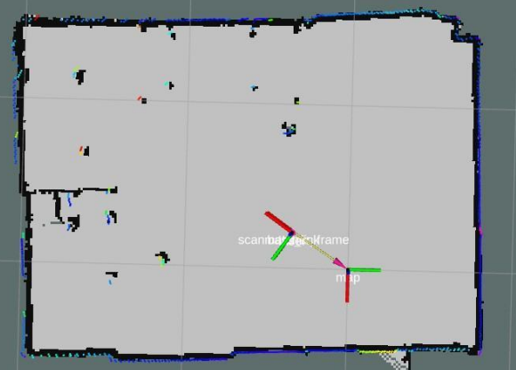
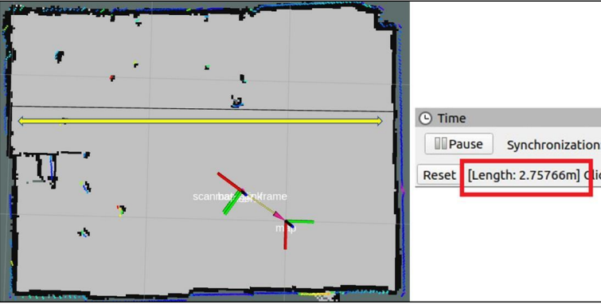

# Mobile Robot Project
### Link demo: https://www.youtube.com/watch?v=NtcUF39E648
  
The robot is controlled using a **computer keyboard** and build a **2D map** utilizing ROS in its environment. It is powered by ROS running on a Raspberry Pi 4B and an Arduino that controls two motors with encoders.  

Robot is a differential drive robot with the motors placed on the same axis.  

## Schematics
  

## Arduino
The arduino node receives the command order from the base controller node and commands the motor speeds. It also sends back the encoder data needed for the odometry to the controller node through ROSSerial.  
  

## Result
This is the complete map of the robot made, and compare it with the actual map  
  

## Compare between the map in RVIZ and the actual map

  

We can observe that the generated map has some discrepancies compared to the actual map. However, the errors are not significant and are within an acceptable range. We can conclude that the combination of LiDAR and Hector SLAM achieves good performance.

## Authors

* **Cong Thanh Ho**