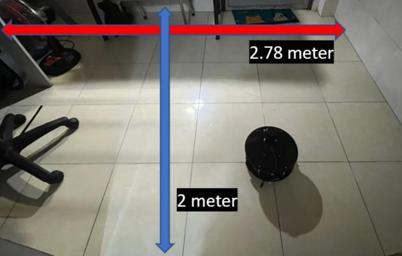

# Mobile Robot Project
  
Robot which uses SLAM (ROS) with a Lidar to build 2D map(using hector slam) in its environment. It is powered by ROS running on a Raspberry Pi 4B and an Arduino that controls two motors with encoders.  

Robot is a differential drive robot with the motors placed on the same axis.  

## Schematics
  

## Arduino
The arduino node receives the command order from the base controller node and commands the motor speeds. It also sends back the encoder data needed for the odometry to the controller node through ROSSerial.  
  

## Result
This is the complete map of the robot made, and compare it with the real map  
  

